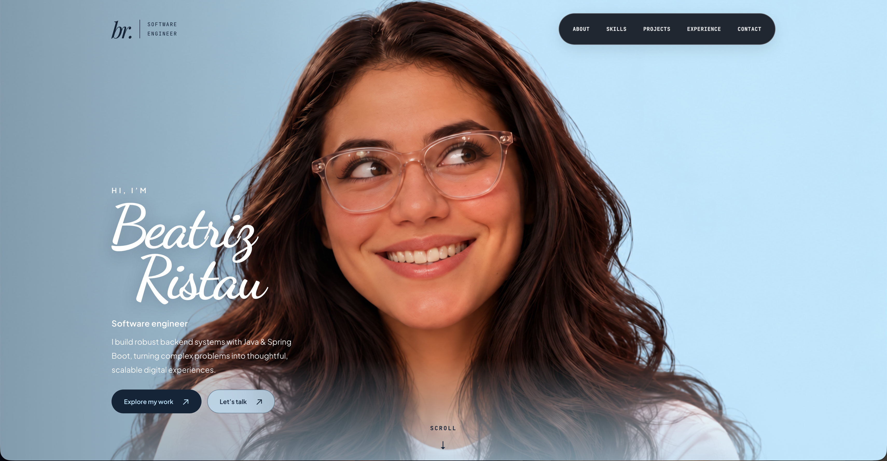

# Beatriz Ristau’s Portfolio

This is my personal portfolio website. I’m a software engineer specialized in backend development with Java and Spring Boot. Here, I showcase my skills, highlight my projects and experience, and provide a contact form so you can reach out for collaboration and/or job opportunities.



## Local preview

No build step or package installation is required. Open `index.html` directly, or start a local server:

```sh
python3 -m http.server 8000 --bind 127.0.0.1
```

Then visit http://127.0.0.1:8000.

## Features

- Responsive layouts and accessible mobile navigation
- Floating glass navigation with a blue scroll progress bar and active section links
- Full-bleed portrait hero with responsive cropping and reduced-motion support
- Filterable skill categories with name-only technology cards and keyboard-accessible tabs
- Project cards with newest-first or oldest-first year sorting, repository links, and work experience
- Existing Formspree contact integration with inline status and error feedback
- Labeled form fields, keyboard focus indicators, and a skip link

## Design

The design uses a light-blue portrait hero (`#B7E6FD`) with dark text, deep navy sections (`#090C15`), and blue accents (`#60A5FA`) on subtly lighter navy cards. Dancing Script supplies the signature and heading accents, Playfair Display the editorial headings, Plus Jakarta Sans the body text, and JetBrains Mono the navigation and metadata. Fonts load through Google Fonts with local fallbacks. Shared design tokens live at the top of `styles.css`.

The supplied portrait is stored locally in `assets/portrait-blue.png`. Desktop presents it as a full-bleed studio image; mobile uses a separate crop and gradient fade to keep the introduction readable. Existing biography, skills, projects, experience, and contact destinations are retained.

## Files

- `index.html` — page content and semantic structure
- `styles.css` — design tokens and responsive styling
- `script.js` — navigation, scroll progress, and contact behavior
- `assets/` — current portrait, favicon, and previous media assets
- `imgs/` — TechOS screenshot

## Contact

The form posts to the existing Formspree endpoint. Local layout checks do not require sending a real message. The email, GitHub, and LinkedIn links are also available directly on the page.

## License

[MIT](LICENSE)
